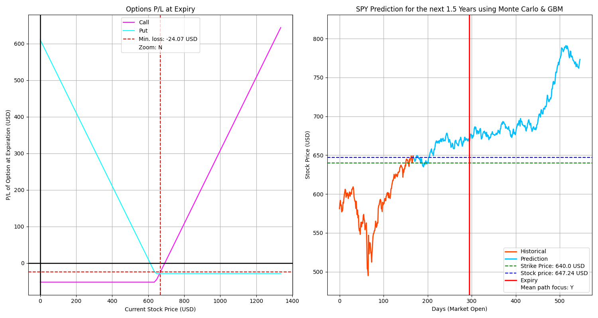

# BlackMonte: Monte Carlo Simulation & Black-Scholes Option Pricing

## Brief Descrioption

-Python-based project:   
-Simulates stock price movements using **Geometric Brownian Motion (GBM)**.   
-Visualises potential future price paths by combining real historical market data with **Monte Carlo Simulations**.   
-Estimates European option prices using the **Black-Scholes Model**.   
-Visualises **Option P/L Scenarios**.  


## Features

-Downloads live market data with **Yahoo Finance API**.  
-Calculates log returns, expected returns, and volatility.  
-Runs **Monte Carlo Simulations** of stock price paths.  
-Generates nice, clear, professional visualisations:  
  -Option payoff at expiry.  
  -Historical stock price vs simulated future price paths.  


## Example Outputs

### Option Payoff Plot and Monte Carlo Simulation




## Installation & Usage  

Clone the repo and install requirements:  

```bash
git clone https://github.com/AJilani08/BlackMonte.git
cd BlackMonte
pip install -r requirements.txt


